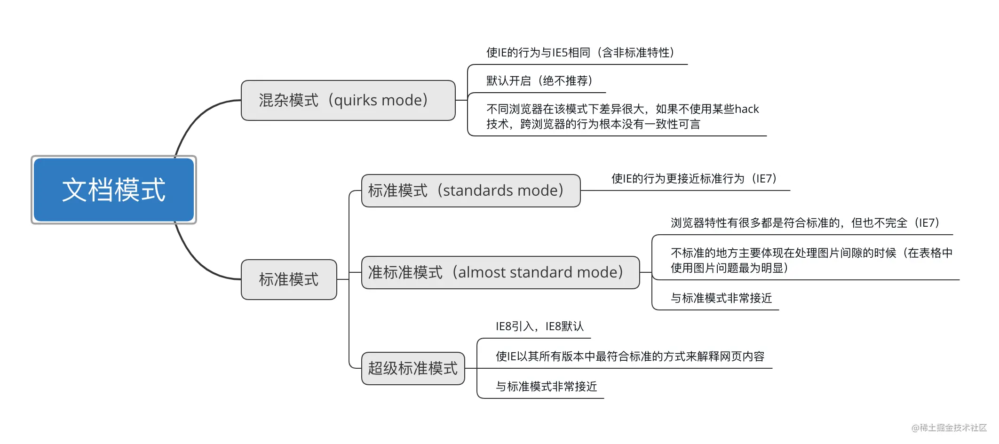

[toc]
# doctype

doctype 不是文本节点，而是一句命令，来指导浏览器选择何种方式渲染网页

- html4 中 doctype 需要对 DID 进行引用，因为h4基于 sgml
-  DID: DTD指的是“文档类型定义” ，是一套关于标记符的语法规则，是html文件的验证机制
-  sgml:Standard Generalized Markup language（SGM或SGML）（以下简称“通用标言”），是一种定义电子文档结构和描述其内容的国际标准语言
-  xml: 可扩展标记语言，宗旨是用开传输数据而不是战术数据




## 区分文档的意义

- ie5.5引入，通过doctype切换文档模式，它的主要作用是高速浏览器以那种方式呈现
- 两种模式都会影响css的呈现，某些情况下也会影响js的执行
- 混杂模式下 1. 盒模型的宽高=内容的宽高 
- 标准模式下 1. 盒模型的宽高=内容的宽高+padding的宽高+border的宽高
- 当一个块元素内容只有图片时，标准模式下图片底部会有3像素留白，混杂模式下没有留白

## 通过dom获得模式
可以通过document.compatMode 来区分混杂模式（BackCompat）和 标准模式(Css1Compat)

## dom中获取doctype
如果咩有声明doctype，那么document.doctype === null
如果有声明，就会拿到命令的全部内容
```js
document.doctype // <!DOCTYPE html>
```